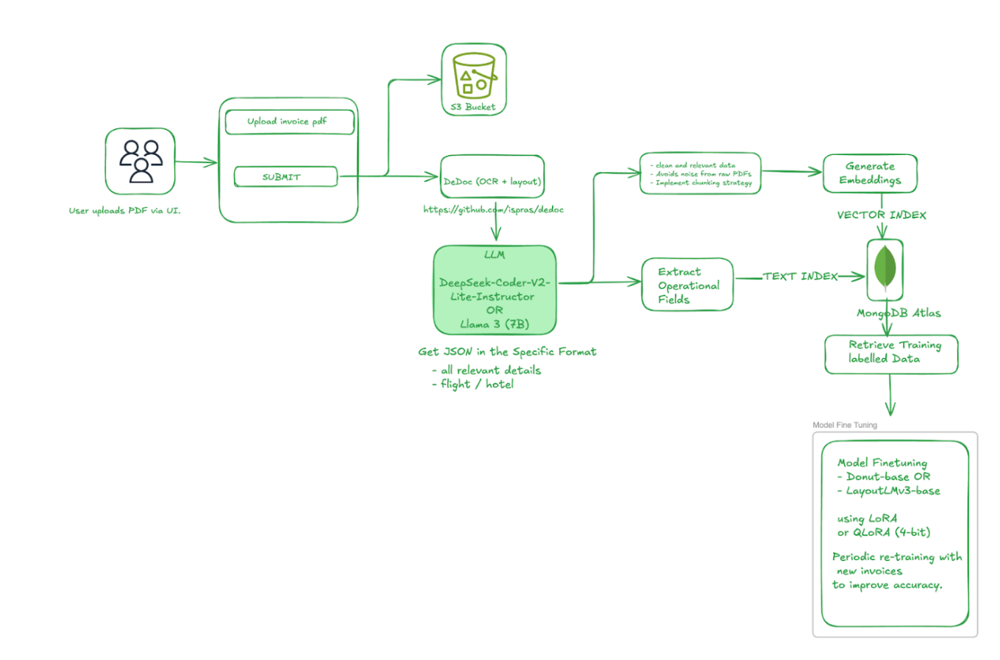
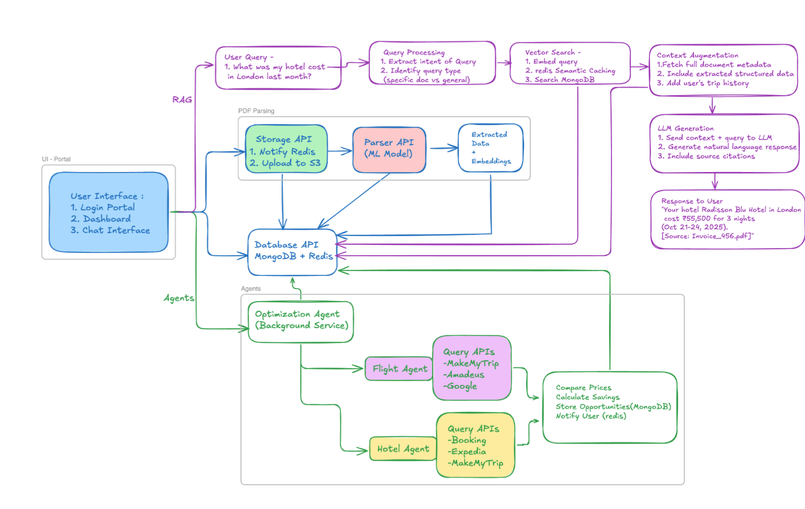

# Trip Optimizer - AI-Powered Travel Expense & Optimization Platform

## Overview

Trip Optimizer is an intelligent travel management platform that combines document processing, ML-based expense extraction, and AI-powered travel optimization. The system automatically processes travel invoices (hotels and flights), extracts structured data using machine learning, and continuously monitors travel APIs to find better pricing opportunities for your trips.

## System Architecture

## Tech Stack

| Category | Technology | Purpose |
|----------|------------|---------|
| **Frontend** | React + Next.js | UI framework |
| | Tailwind CSS | Styling |
| **Backend** | Python | Backend services |
| | Node.js | Additional services |
| **Database** | MongoDB | Primary database + Vector search |
| | Redis | Semantic caching, Auth token storage, Pub/Sub messaging |
| **Storage** | AWS S3 | File storage |
| **AI/ML** | DeDoc | OCR + Layout parsing |
| | Voyage-3-large | Embeddings |
| | Mistral 7B(v0.3) / Llama 2 7B / gemma3:4b (Text, Image) | LLMs |
| | LayoutLMv3 + LoRA | PDF extraction model tuning |
| **Infrastructure** | Docker + Docker Compose | Containerization |
| | Kubernetes (Minikube) | Deployment |
| | AWS Cognito | Authentication |
| | Atlas Search | Autocomplete capabilities |
| **Automation** | K8s Cron Jobs | Scheduled tasks |
| | Periodic model fine-tuning | ML model updates |

## Features

1. 📄 Invoice Upload & AI-Powered Parsing
2. 🔍 Autonomous Travel Optimization
3. 💬 Conversational AI Interface (RAG)

### 1. 📄 Invoice Upload & AI-Powered Parsing
Users upload hotel and flight invoices (PDF format)

Machine learning models extract structured data:
- Flight details (dates, routes, prices, booking references)
- Hotel information (check-in/out, location, costs, amenities)
- Passenger/guest details

### 2. 🔍 Autonomous Travel Optimization
- **Continuous Monitoring**: AI agents periodically scan external travel APIs
- **💰 Price Optimization**: Identifies better flight and hotel deals
- **🎯 Smart Recommendations**: Suggests optimal rebooking opportunities
- **📊 Savings Tracking**: Monitors potential cost savings
- **⚡ Real-time Alerts**: Notifies users of significant price drops

### 3. 💬 Conversational AI Interface (RAG)
- **Context-Aware Chat**: Ask questions about your travel documents
- **📚 Multi-Document Queries**: Search across all uploaded invoices
- **🧠 Intelligent Retrieval**: RAG-powered responses with source citations
- **🗺️ Trip Planning Assistance**: General travel advice and recommendations
- **📈 Expense Analysis**: Query spending patterns and trip costs

## Quick Start

### Application Commands

| Command | Description | What It Does |
|---------|-------------|--------------|
| `./deploy-yaml.sh` | **Start Everything** | Builds images, deploys to Kubernetes, sets up port forwarding |
| `./deploy-yaml.sh status` | **Check Status** | Shows all pods, services, and port forwarding status |
| `./deploy-yaml.sh port-forward` | **Fix Connections** | Restarts port forwarding if APIs are not accessible |
| `./deploy-yaml.sh stop` | **Stop Everything** | Stops all services and cleans up |
| `./deploy-yaml.sh restart` | **Restart Everything** | Stops and redeploys everything |

## 🌐 Access URLs

| Service | URL | Purpose |
|---------|-----|---------|
| **Frontend** | http://localhost:3000 | Main application |
| **Backend API** | http://localhost:8000 | Core API |
| **Auth API** | http://localhost:8003 | Authentication |
| **Database API** | http://localhost:8002 | Data management |
| **Storage API** | http://localhost:8001 | File storage |

## 👤 Admin Access

| Field | Value |
|-------|-------|
| **Username** | `admin` |
| **Password** | `Admin123!` |
| **Email** | `admin@tripoptimizer.com` |
| **Role** | Administrator |