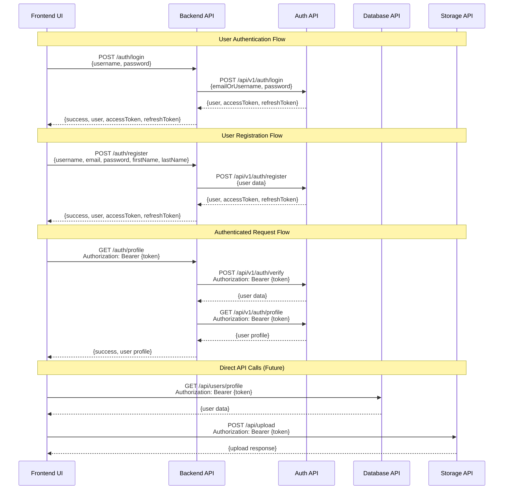

# Trip Optimizer Backend API

## Overview

The Backend API serves as a **lightweight orchestrator** for the Trip Optimizer application. It acts as a central gateway that coordinates requests between the frontend and various microservices, handling authentication flows and user management operations.

## Architecture Role

This backend is intentionally designed to be **simple and focused** - it doesn't perform complex business logic or data processing. Instead, it:

- **Routes requests** from the frontend to appropriate microservices
- **Handles authentication flows** by coordinating with the Auth API
- **Manages CORS** and basic request/response formatting
- **Provides a unified API interface** for the frontend

## Request Flow Architecture



## Key Features

### 🔐 Authentication Orchestration
- **Login/Register**: Routes authentication requests to Auth API
- **Token Verification**: Validates JWT tokens with Auth API
- **Profile Management**: Coordinates user profile operations
- **Logout**: Handles user logout through Auth API

### 🌐 API Gateway Functions
- **CORS Management**: Handles cross-origin requests from frontend
- **Request Routing**: Directs requests to appropriate microservices
- **Response Formatting**: Standardizes API responses
- **Error Handling**: Provides consistent error responses

### 🔄 Token Management
- **JWT Handling**: Manages access and refresh tokens
- **Token Validation**: Verifies tokens with Auth API
- **Authorization**: Enforces authentication for protected endpoints

## API Endpoints

### Authentication Endpoints

| Method | Endpoint | Description | Auth Required |
|--------|----------|-------------|---------------|
| `POST` | `/auth/login` | User login | ❌ |
| `POST` | `/auth/register` | User registration | ❌ |
| `GET` | `/auth/profile` | Get user profile | ✅ |
| `POST` | `/auth/logout` | User logout | ✅ |

### System Endpoints

| Method | Endpoint | Description | Auth Required |
|--------|----------|-------------|---------------|
| `GET` | `/` | API information | ❌ |
| `GET` | `/health` | Health check | ❌ |

## Environment Configuration

The backend uses environment variables for configuration:

```bash
# Server Configuration
API_HOST=0.0.0.0
API_PORT=8000
FRONTEND_URL=http://localhost:3000

# Microservice URLs
AUTH_API_URL=http://localhost:8003
DATABASE_API_URL=http://localhost:8002
STORAGE_API_URL=http://localhost:8001
```

## Dependencies

The backend has minimal dependencies, keeping it lightweight:

- **FastAPI**: Web framework for building APIs
- **Uvicorn**: ASGI server for running the application
- **Pydantic**: Data validation and serialization
- **httpx**: HTTP client for API calls
- **python-dotenv**: Environment variable management

## Running the Backend

### Development Mode

```bash
# Install dependencies
pip install -r requirements.txt

# Set up environment variables
cp env.example .env
# Edit .env with your configuration

# Run the application
python app/main.py
```

### Docker Mode

```bash
# Build the image
docker build -t trip-optimizer-backend .

# Run the container
docker run -p 8000:8000 --env-file env.development trip-optimizer-backend
```

## Design Philosophy

### Why Keep It Simple?

1. **Single Responsibility**: The backend focuses solely on orchestration
2. **Microservice Architecture**: Business logic lives in dedicated services
3. **Scalability**: Easy to scale individual components independently
4. **Maintainability**: Simple code is easier to debug and modify
5. **Performance**: Minimal overhead for request routing

### What It Doesn't Do

- ❌ **Database Operations**: Handled by Database API
- ❌ **File Storage**: Handled by Storage API  
- ❌ **Authentication Logic**: Handled by Auth API
- ❌ **Business Logic**: Distributed across microservices
- ❌ **Data Processing**: Performed by specialized services

## Future Enhancements

As the application grows, the backend may evolve to include:

- **API Rate Limiting**: Protect against abuse
- **Request Logging**: Monitor API usage
- **Caching Layer**: Improve response times
- **Load Balancing**: Distribute requests across service instances
- **Circuit Breakers**: Handle service failures gracefully

## Integration with Microservices

The backend coordinates with these services:

- **Auth API** (`:8003`): User authentication and JWT management
- **Database API** (`:8002`): User data and profile management  
- **Storage API** (`:8001`): File upload and document management

## Health Monitoring

The backend provides health check endpoints for monitoring:

- `GET /health`: Returns service status and timestamp
- `GET /`: Returns API version and basic information

## Security Considerations

- **CORS**: Configured to allow requests from frontend only
- **JWT Validation**: All protected endpoints validate tokens
- **Environment Variables**: Sensitive data stored in environment files
- **HTTPS**: Should be used in production environments

---

**Note**: This backend is designed to be a simple orchestrator. For complex business logic, refer to the individual microservice documentation.
